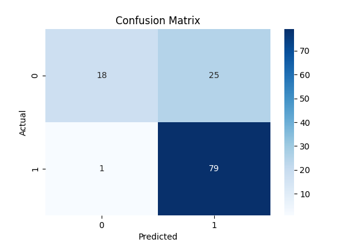
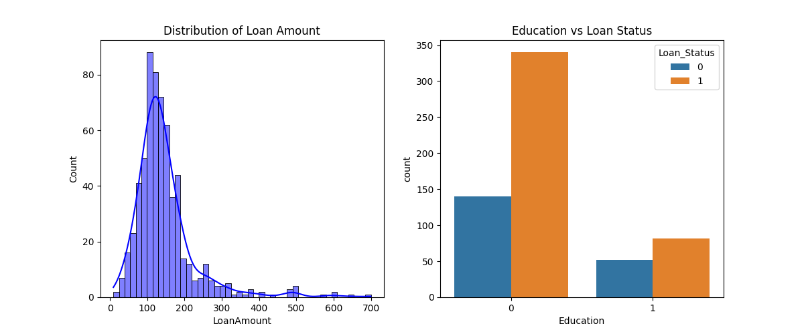

# 🏦 Credit Risk Prediction Project

##  Task Objective
The primary objective of this project is to build a predictive model that can identify whether a loan applicant is likely to **default** or **pay back** their loan. By automating this process using Machine Learning, financial institutions can:
* Minimize financial losses by identifying high-risk applicants.
* Speed up the loan approval process for low-risk customers.
* Ensure data-driven decision-making based on historical patterns.

---

##  My Approach
To solve this problem, I followed a structured Data Science pipeline:

### 1. Data Acquisition & Understanding
* Utilized the **Loan Prediction Dataset** (Kaggle).
* Performed initial inspection to understand features like `Gender`, `Married`, `Education`, `ApplicantIncome`, and `Credit_History`.

### 2. Data Cleaning & Pre-processing
* **Missing Value Imputation:** Categorical features were filled with the **Mode**, while numerical features (like `LoanAmount`) were filled with the **Median**.
* **Label Encoding:** Converted categorical data into numeric format.
* **Feature Selection:** Dropped irrelevant columns (like `Loan_ID`) to improve model efficiency.

### 3. Exploratory Data Analysis (EDA)
* Visualized data distributions using **Seaborn** and **Matplotlib**.
* Created a **Correlation Heatmap** to identify features that impact loan approvals the most.

---

##  Repository Contents
| File | Description |
| :--- | :--- |
| `cleaned_data.csv` | The dataset after cleaning and encoding. |
| `eda_plots.png` | Visualizations of Loan Amount and Education. |
| `confusion_matrix.png` | Model performance visualization. |
| `evaluation_report.txt` | Accuracy, Precision, and Recall scores. |

---

## 📊 Results and Insights

### 🚀 Model Performance
The model was evaluated using a Confusion Matrix and Accuracy Score:
* **Confusion Matrix:** Summary of Correct vs. Incorrect predictions.

### 💡 Key Insights
* **Credit History is King:** Applicants with a clean credit history have an overwhelmingly higher chance of approval.
* **Education Impact:** Graduates generally show a better repayment profile.
* **Data Visualization:** Below is the distribution of key features analyzed during EDA.

---
**Prepared by:** Qazi Abubakar Siddiqui
**Task:** Credit Risk Prediction (Machine Learning)
