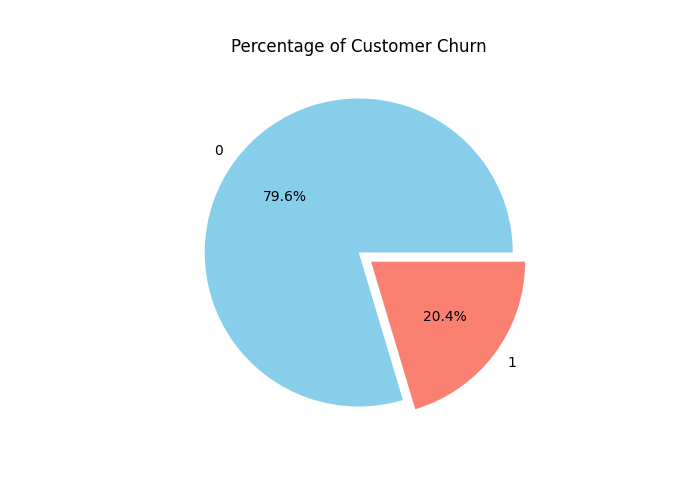
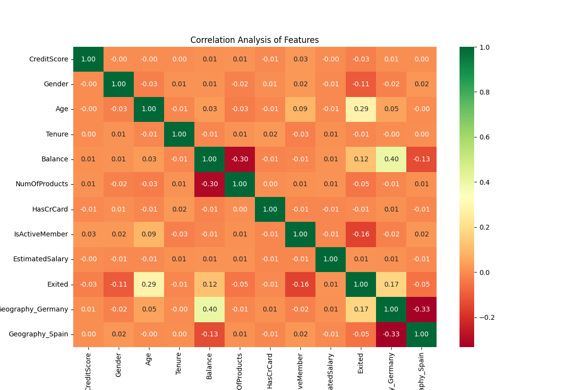
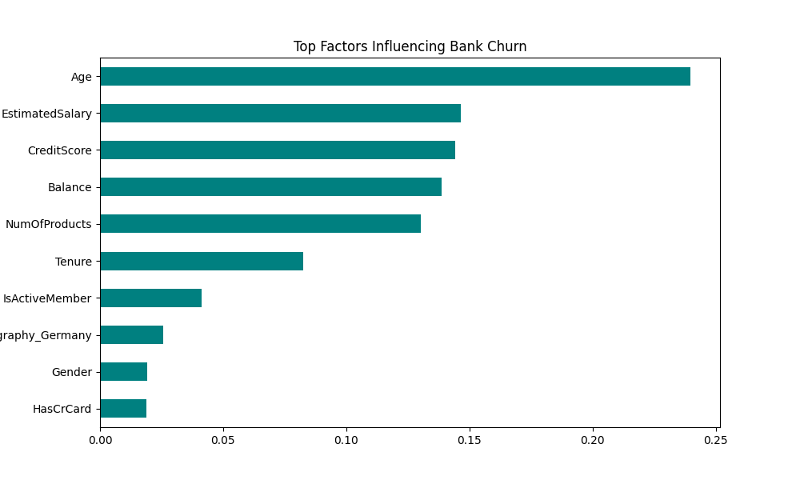

# Bank Customer Churn Prediction

---

## 1. Project Objective
The goal of this task is to identify customers who are likely to leave the bank. By building a classification model, we can predict customer churn based on demographic and financial data, allowing the bank to take preventive measures to retain its clients.

---

## 2. Approach and Methodology

### Data Cleaning and Preparation
* **Feature Selection:** Dropped unnecessary columns like `RowNumber`, `CustomerId`, and `Surname`.
* **Handling Categorical Data:** * **Gender:** Converted to numerical values using **Label Encoding**.
    * **Geography:** Processed using **One-Hot Encoding** to handle multi-class locations (France, Germany, Spain).
* **Feature Scaling:** Used **StandardScaler** to normalize the numerical data for better model performance.

### Model Training
* Used a **Random Forest Classifier** to train on 80% of the data.
* Evaluated the model on the remaining 20% test set to ensure accuracy and reliability.

---

## 3. Exploratory Data Analysis (EDA)

Below are the visual insights generated during the process:

### Churn Distribution
This chart represents the percentage of customers who stayed versus those who exited.

### Correlation Heatmap
This heatmap illustrates the relationship between different features in the dataset.

---

## 4. Results and Insights

### Model Performance
The performance of the model was captured using a confusion matrix and detailed metrics.
png)

### Feature Importance
The following chart shows the most significant factors that influence a customer's decision to leave the bank.

**Key Observations:**
* **Age:** Proved to be one of the most critical factors; older customers are more likely to churn.
* **Balance:** High-balance customers show specific churn patterns that the bank should monitor.
* **IsActiveMember:** Active members have a much lower probability of leaving the bank.

---

## 5. Project Deliverables (Output Files)

| File Name | Description |
| :--- | :--- |
| **Original_Churn_Modelling.csv** | The original raw dataset. |
| **Cleaned_Churn_Data.csv** | Dataset after cleaning and encoding. |
| **classification_report.csv** | Numerical performance results (Precision, Recall, F1). |
| **churn_pie_chart.png** | Visualization of churn ratio. |
| **correlation_heatmap.png** | Visual of feature relationships. |
| **confusion_matrix.png** | Model prediction accuracy results. |
| **feature_importance.png** | Visual ranking of churn drivers. |

---

## 6. Conclusion
The model effectively predicts bank churn. Based on the **Feature Importance** analysis, the bank is advised to focus on customer engagement and loyalty programs for older demographics and inactive members to improve retention rates.
