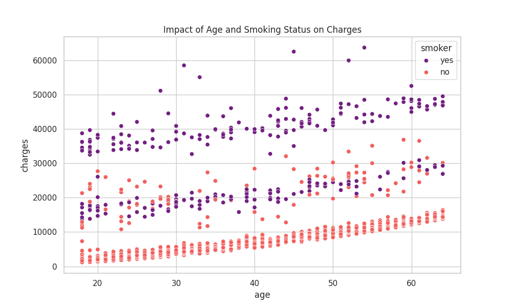
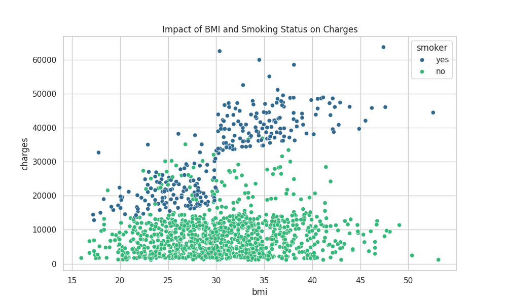
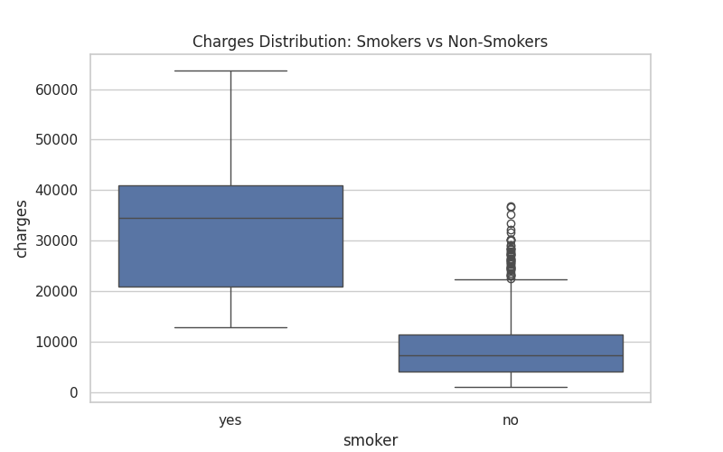
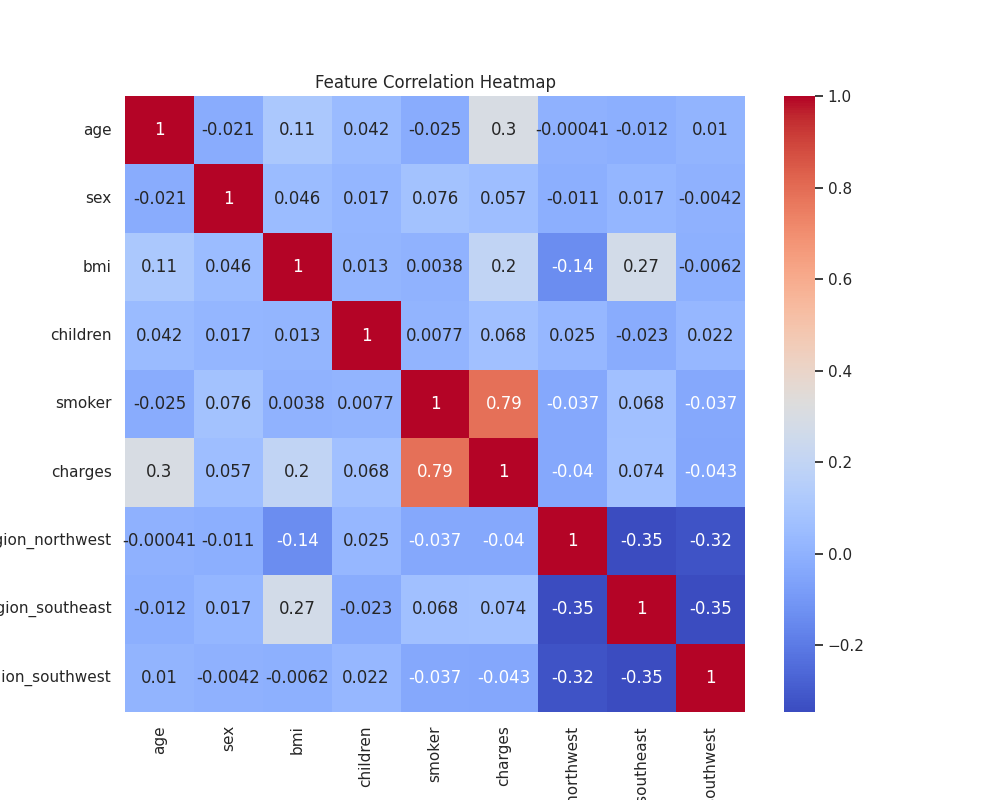

# Task 4: Predicting Insurance Claim Amounts

## Objective
The primary goal of this project is to estimate medical insurance claim amounts (charges) based on personal and demographic data. Using the **Medical Cost Personal Dataset**, we aim to build a predictive model that can accurately forecast costs based on individual health and lifestyle factors.

## Approach
To achieve a reliable prediction, the following systematic steps were implemented:

1. **Data Acquisition:**  
   The original dataset was fetched directly from a public repository to ensure data integrity.

2. **Data Cleaning & Preparation:**
   - Handled categorical variables (sex, smoker, and region) using Label Encoding and One-Hot Encoding.
   - Verified data for missing values to ensure a clean input for the model.

3. **Exploratory Data Analysis (EDA):**
   - Analyzed the relationship between variables like BMI, Age, and Smoking Status against the target variable (Charges).
   - Generated high-quality visualizations to understand data distribution and feature correlations.

4. **Model Training:**
   - Implemented a **Linear Regression** model.
   - Split the dataset into training (80%) and testing (20%) sets to validate performance.

5. **Evaluation:**
   - Measured performance using **Mean Absolute Error (MAE)** and **Root Mean Squared Error (RMSE)**.

---

## Visualizations & Data Files

### Dataset

**medical_insurance_dataset.csv**  
The original processed dataset used for training and analysis.

---

### Age vs Charges

This scatter plot shows the correlation between age and insurance charges.

---

### BMI vs Charges

This visualization highlights how Body Mass Index (BMI) impacts medical insurance costs.

---

### Smoker Impact on Charges

This boxplot demonstrates the significant difference in insurance charges between smokers and non-smokers.

---

### Correlation Heatmap

This heatmap shows the relationships and correlations between all numerical features in the dataset.

---

### Model Evaluation Results

**model_evaluation_results.txt**

This file contains:

- Mean Absolute Error (MAE)
- Root Mean Squared Error (RMSE)
- R-squared Score

---

## Results and Insights

- **Smoking is the Critical Factor:**  
  The visualizations (specifically `smoker_impact.png`) reveal that smokers pay significantly higher premiums than non-smokers.

- **Linear Growth with Age:**  
  As age increases, insurance charges show a consistent upward trend.

- **BMI and Charges:**  
  High BMI values are strongly correlated with increased medical costs, especially when the individual is also a smoker.

- **Model Accuracy:**  
  The Linear Regression model provides a robust estimation, successfully identifying the weight of each personal attribute on the final claim amount.

---

## Conclusion

This documentation provides a comprehensive overview of the insurance prediction task. By utilizing data cleaning, exploratory analysis, and regression modeling, we successfully identified the primary drivers of medical insurance costs and built a functional predictive framework.
