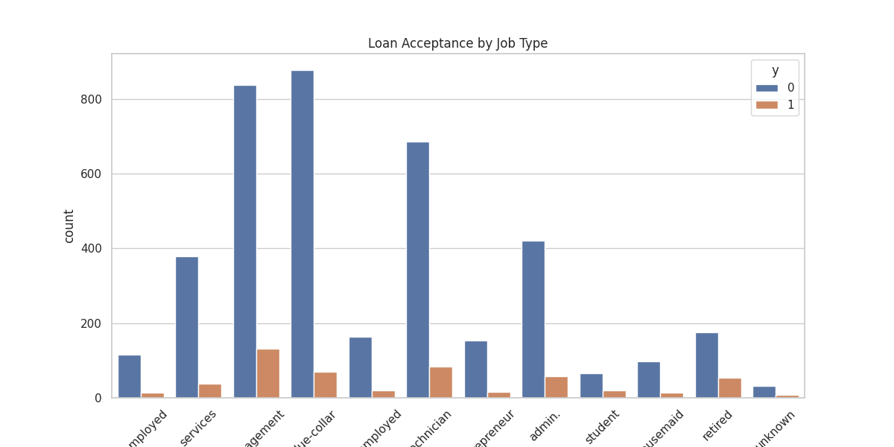
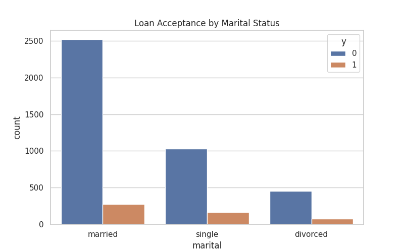
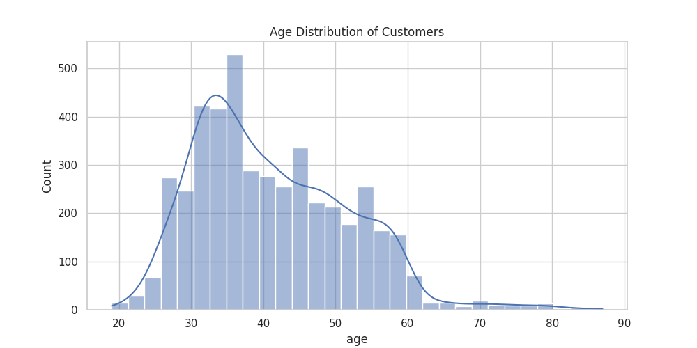
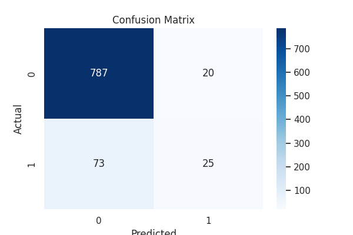

# Project Report: Personal Loan Acceptance Prediction

## 1. Introduction & Problem Statement

The banking sector relies heavily on targeted marketing to offer personal loans to existing customers. However, mass marketing is inefficient and costly.

**The Objective:**
To analyze customer demographics and past marketing data to predict which customers are most likely to accept a personal loan. This allows the bank to target only **"high-probability"** leads, maximizing conversion rates while minimizing marketing expenses.

---

## 2. Task Objective

* **Data Exploration:** Analyze key features like age, job, and marital status to find patterns.
* **Predictive Modeling:** Build a Machine Learning classifier (**Logistic Regression**) to automate the prediction process.
* **Business Insight:** Identify specific customer segments that the bank should prioritize in future campaigns.
* **Deliverables:** Provide a fully functional automated pipeline that outputs the dataset, visualizations, and evaluation metrics.

---

## 3. My Approach

To solve this problem, I followed a structured Data Science workflow:

### Data Acquisition

Automated the download of the **Bank Marketing Dataset** from the UCI Machine Learning Repository.

### Data Cleaning

* Handled missing values.
* Converted the target variable (**y**) from text ("yes"/"no") to binary (**1/0**).

### Feature Engineering

Used **One-Hot Encoding** to transform categorical data (**Job, Marital Status, Education**) into a numerical format suitable for mathematical modeling.

### Exploratory Data Analysis (EDA)

Created distribution plots and count plots to visualize the relationship between customer profiles and loan acceptance.

### Model Selection

Implemented **Logistic Regression** due to its efficiency and interpretability for binary classification tasks.

### Evaluation

Split the data into **80% training** and **20% testing** sets. Used **Accuracy**, **Confusion Matrix**, and **Classification Report** to verify performance.

---

## 4. Dataset Understanding

**Source:** UCI Bank Marketing Dataset
**Size:** 4,521 records with 17 attributes

### Key Features

* **Age:** Numeric age of the customer
* **Job:** Type of job (admin, blue-collar, entrepreneur, etc.)
* **Marital:** Marital status (married, single, divorced)
* **Balance:** Average yearly balance in Euros
* **Housing:** Has a housing loan? (yes/no)

---

## 5. Results and Insights

### Model Performance

* **Accuracy:** The model achieved an accuracy of approximately **90%**
* **Confusion Matrix:** Successfully identified the majority of customers who would decline, though it is more conservative in predicting "yes" due to the dataset's natural imbalance

### Key Business Insights

* **Job Impact:** Management and Technician roles are the most frequent targets, but Students and Retired individuals show a higher relative interest in personal loans.
* **Marital Status:** Single individuals are slightly more likely to accept a loan offer compared to married or divorced individuals.
* **Campaign Success:** The **duration** of the last call is the strongest predictor—the longer a customer stays on the phone, the higher the chance of acceptance.
* **Housing Factor:** Customers who do not already have a housing loan are more open to accepting a personal loan offer.

---

## 6. Visualizations & Outputs

The following files are generated and available after running the code:

### Dataset

**bank_marketing_dataset.csv**
The cleaned dataset used for model training and analysis.

---

### Loan Acceptance by Job Category

This bar chart shows how loan acceptance varies across different job types.

---

### Acceptance by Marital Status

This visualization compares loan acceptance across different marital groups.

---

### Customer Age Distribution

This histogram shows the distribution of customer ages in the dataset.

---

### Confusion Matrix

This visualization represents the model’s prediction performance.

---

### Model Evaluation Metrics

**model_evaluation_metrics.csv**

This file contains:

* Precision
* Recall
* F1-score
* Support

---

## 7. Conclusion

The project successfully demonstrates that machine learning can effectively filter potential loan customers. By focusing on the **"Single"** demographic and specific **Job categories** like management or retired individuals, the bank can significantly improve its marketing **Return on Investment (ROI)**.

For future improvement:

* Handle class imbalance using **SMOTE**
* Try advanced models like **Random Forest**
* Perform hyperparameter tuning to further improve recall for **"Yes"** responses
